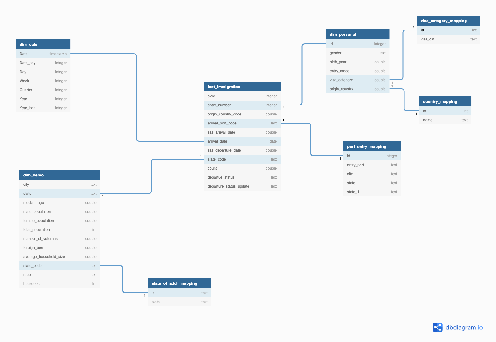

## Capstone-Project

#### Step1: Scope 

**In this project I want to anylse immigration rate of different US states by Origin Countries**

**Solution**:

- data-lake on cloud storage using apache spark.
- data warehouse using AWS (Redshift)

data-lake involves 4 layers
- **raw**
  - data is read from source and stored as parquet for better performance in raw layer.
- **staging** 
    - Source data is read and loaded as parquet in the stagging layer using partition on year and month
- **transformation**
    - Data transformations are performed on the stagged data and saved as parquet using partition on year and month
- **analysis**
    - From transformed data, we extract data and store it as dimensions and facts. This analysis data then can be loaded into AWS Redshift Datawarehouse. Which scales according to the load.

**Technologies**:
1. AWS S3 for Data Lake
2. Spark : its a great fit for big data processing and analysis (can be used on emr cluster/ aws glue)
3. AWS Redshift (This is used as it can handle  big data sets and number of concurrent users upto 500)
4. We can schedule etl jobs by different approaches namely:
    - airflow 
    - cron job
    - app flow from aws
    - Step functions
    
#### Dataset used
- I94 Immigration Data
- us-cities-demographic
- mapping tables

#### Describe and Gather Data 
* I94 Immigration Data: This data comes from the US National Tourism and Trade Office
* us-cities-demographic dataset: This data comes from OpenSoft. You can read more about it [here](https://public.opendatasoft.com/explore/dataset/us-cities-demographics/export/)
* mapping tables: Look up tables for data used in immigration dataset.

### Step 2: Explore and Assess the Data
Data set contains information of each immigrant comming to US. 
In my use case , I want to perform analysis based on  immigrants comming to different US states via air.

- `Data set is only filtered on air mode = 1.`
- `remove all records where entry number of the personal is duplicated or doesnot make any sense`
- `data labels provided as sas is converted to json file `
- `json file is then mapped and converted to lookup parquet files for further analysis`
- `date dim is created to join it with the date fields if required for future analysis`
- `from orgin port mapping labels , country and state fields are extracted`
- `data is stored by partition on year and month`
- `data is written in overwrite mode in parquet format. So all data related to a year and month is overwritten when etl.py file is running` 

### Step3:  Data Model 
- I have used database modeling tool to come up with data model.
- Data Model is extensible, We can further add temperature data to perform in depth analysis 

### ETL Steps
#### Extract
* read data from source sas data format
    * `df_sas=spark.read.format('com.github.saurfang.sas.spark').load('../../data/18-83510-I94-Data-#2016/i94_apr16_sub.sas7bdat')`

* add year and month columns to partition data
    * `df_sas = df_sas.withColumn("year",df_sas.i94yr.cast('integer')).withColumn("month",df_sas.i94mon.cast('integer'))`

* write data to raw layer
    * `df_sas.write.mode("overwrite").partitionBy("year","month").parquet('raw/facts_air_immigration')`

* read data in parquet format from raw layer and **filter** it on **air_mode==1**
    * `df_parq = spark.read.parquet('raw/facts_air_immigration/year=*/month=*/*.parquet')`  
    * `df_parq_air =  df_parq.filter(df_parq.i94mode == 1)`

  *  extract json from I94_SAS_Labels_Description.SAS by running sas_labels_json.py
   
#### Tranform
* create  temp table to stage data to  perform transformations
  * `df_parq_air.createOrReplaceTempView('dataset')`

* stage personal dimension by selecting required columns from the **dataset** view created in previous step. 
  * Please look at transformations_sql.py file  for sql statement used in following step
  * `dim_personal_stg = spark.sql(transformations_sql.dim_personal_stg)`

* write this data to staging layer
  * `dim_personal_stg.write.mode('overwrite').parquet('staging/dim_personal/')`

* stage  facts data  
  * perform query on **dataset** to select columns and rename columns, additionaly _year and _month columns are added to partition data 
    * `facts_staging = spark.sql(transformations_sql.facts_staging)`
  
  * save this data frame to staging layer
   * `facts_staging.write.partitionBy("_year","_month").mode('overwrite').parquet("staging/facts_air_immigration")`

* load dim personal from staging layer and remove duplicates (transformations_sql.py for queries)
  * `personal_stg_read =spark.read.format("parquet").load('staging/dim_personal/') `
  * `personal_stg_read.createOrReplaceTempView("ds_personal_stg")` (create view)
  * `dim_personal= spark.sql(transformations_sql.dim_personal)`
  

* load facts from staging layer and remove all rows with duplicate immigrant entry number  
     
  * `dim_personal.createOrReplaceTempView('ds_personal')   `
  
  * `fact_stg_read = spark.read.parquet("staging/facts_air_immigration/_year=*/_month=*/*.parquet")`

  * `fact_stg_read.createOrReplaceTempView("dataset_stg")`

  * perform data quality checks to find out if stagged data sets are not empty
    * transformations_sql.check_dataframe_empty(fact_stg_read)
    * transformations_sql.check_dataframe_empty(personal_stg_read)
  
  * keep only entry_numbers in facts table we have in personal dimension by joining the tables
    * `fact_us_immigrations= spark.sql(transformations_sql.fact_us_immigrations).drop_duplicates()`

 
### Load
Transformed Data frames are written to Transformation layer
* `dim_personal.write.mode("overwrite").parquet('./transformation/dim_personal')`
* `fact_us_immigrations.write.mode("overwrite").partitionBy('_year','_month').parquet('transformation/facts_immigration')`

* `mapping_tables.py` will create mapping tables as shown in Data model.

### Step4: Data Dictionary 
#### Transformed layer from Data Lake
**facts_immigration**
  - cicid: surrogate key
  - year: 4 digits integer
  - month: 2 digits integer
  - entry_number: unique entry number allocated to an immigrant  
  - origin_country_code: code of the origin coutry^11   
  - arrival_port_code: 3 digits arrival port code
  - sas_arrival_date: arrival date
  - sas_departure_date: departure date 
  - state_code: us state code
  - count: immigrant count(always 1 for each row)
  - departue_status: departure flag - departed, lost i-94 or is deceased 
  - departure_status_update: update flag - either apprehended, overstayed, adjusted to perm residence

**dim_personal**
  - id: unique entry number allocated to an immigrant  
  - gender: gender
  - birth_year: birth year 
  - entry_mode: entry mod code (1,2,3)
  - visa_category: visa category code
  - origin_country: code of the origin coutry

**dim_us_demographics**
  - city: city
  - state: state
  - median_age: median_age
  - males: males
  - females: females
  - total_population: total_population
  - veterans: veterans
  - foreign-born: foreign-born
  - average_household: average_household
  - state_code: state_code
  - race: race
  - house_holds: house_holds

**dim_date**
 - Date: date 
 - Date_key: date in int format
 - Day: day name
 - Week: week number 
 - Quarter: quarter number
 - Year: 4 digit integer  
 - Year_half: 1 digit integer

**country_mapping**
 - code: Code of the origin coutry
 - country: country name

**mode_of_entry_mapping**
 - id: mode of entry code
 - entry_mode: type of entry mode

**port_entry_mapping**
 - id: port code
 - entry_port: name of entry port
 - city: city of entry port
 - state: US state code
 - state_1: In case field has 2 delimeters, can be ignored

**state_of_address_mapping**
 - id: state id
 - state_name: state_name

**visa_cat_mapping**
 - id: visa category id
 - visa_type: visa type business, study , travel

#### Step4.1:  Analysis layer from Data Lake

**immigration_rate_us_states**
 - year:  4 digits integer
 - month: 2 digits integer 
 - state_name: name of us state
 - country: origin country name
 - total_immigrants: total immigrants in this month and year
 - total_immigrants_state: total immigrants of us state
 - immigrants_by_country: immigrant by country
 - percent_total: percent total for each state comming from different origin countries

**further Analysis could be added**

### Step5:  How to run this project
1. run bash_operator_etl.sh script to perform etl. It runs all python files required to perform etl with data quality checks
2. run bash_operator_analysis.sh script to perform analysis step with data quality check.
3. All data-layers folders are empty.
4. Please provide  these files `../../data/18-83510-I94-Data-#2016/i94_apr16_sub.sas7bdat` to perform all the process.
5. dataset folder include csv files on weather and airport data. I am not uploading it.It was available in docker workspace

### Step6: Project write up

### 6.1 Purpose of  Data Model
- This data will be used to perform analysis on immigration rate of different US states with respect to origin countries.
- Data will be used internally by BI/Analyst team.
- Analysis data is loaded to Analysis layer on S3 and AWS Redshift as well.
  - Users can connect directly to Redshift by using BI tools like Tableau, Qlik, Power BI etc
  - Users can also access data on S3 using AWS Athena and AWS QuickSight

### 6.2 scenarios

**The data was increased by 100x** 
- Storing analysis data in Analysis layer using S3 and then loading data into AWS Data warehouse Redshift which is optimized for read heavy workloads and aggregations, can handle this scenario.
  
**The pipelines would be running on a daily basis by 7 am every day.**
- Using Airflow dags,theywhich can be scheduled to run when using cron job.
  
**The database needed to be accessed by 100+ people.**
- Using Redshift will also cater to this scenario.

