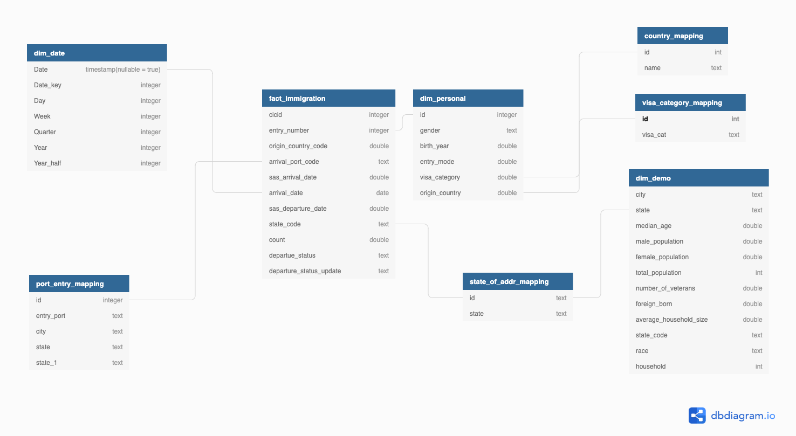

## Capstone-Project

#### Step1: Scope 

**In this project I want to anylse immigration rate of different US states by Origin Countries**

**Solution**:

- data-lake on cloud storage using apache spark.
- data warehouse using AWS (Redshift)

data-lake involves 4 layers
- **raw**
  - data is read from source and stored as parquet for better performance in raw layer.
- **staging** 
    - Source data is read and loaded as parquet in the stagging layer using partition on year and month
- **transformation**
    - Data transformations are performed on the stagged data and saved as parquet using partition on year and month
- **analysis**
    - From transformed data, we extract data and store it as dimensions and facts. This analysis data then can be loaded into AWS Redshift Datawarehouse. Which scales according to the load.

**Technologies**:
1. AWS S3 for Data Lake
2. Spark : its a great fit for big data processing and analysis (can be used on emr cluster/ aws glue)
3. AWS Redshift (This is used as it can handle  big data sets and number of concurrent users upto 500)
4. We can schedule etl jobs by different approaches namely:
    - airflow 
    - cron job
    - app flow from aws
    - Step functions
    
#### Dataset used
- I94 Immigration Data
- us-cities-demographic
- mapping tables

#### Describe and Gather Data 
* I94 Immigration Data: This data comes from the US National Tourism and Trade Office
* us-cities-demographic dataset: This data comes from OpenSoft. You can read more about it [here](https://public.opendatasoft.com/explore/dataset/us-cities-demographics/export/)
* mapping tables: Look up tables for data used in immigration dataset.

### Step 2: Explore and Assess the Data
Data set contains information of each immigrant comming to US. 
In my use case , I want to perform analysis based on  immigrants comming to different US states via air.

- `Data set is only filtered on air mode = 1.`
- `remove all records where entry number of the personal is duplicated or doesnot make any sense`
- `data labels provided as sas is converted to json file `
- `json file is then mapped and converted to lookup parquet files for further analysis`
- `date dim is created to join it with the date fields if required for future analysis`
- `from orgin port mapping labels , country and state fields are extracted`
- `data is stored by partition on year and month`
- `data is written in overwrite mode in parquet format. So all data related to a year and month is overwritten when etl.py file is running` 

### Step3:  Data Model 
- I have used database modeling tool to come up with data model.
- Data Model is extensible, We can further add temperature data to perform in depth analysis 

### Step4: Data Dictionary 
#### Transformed layer from Data Lake
**fact table**
  - cicid: double (nullable = true)
  - year: integer (nullable = true)
  - month: integer (nullable = true)
  - entry_number: double (nullable = true)
  - origin_country_code: double (nullable = true)
  - arrival_port_code: string (nullable = true)
  - sas_arrival_date: string (nullable = true)
  - sas_departure_date: double (nullable = true)
  - state_code: string (nullable = true)
  - count: double (nullable = true)
  - departue_status: string (nullable = true)
  - departure_status_update: string (nullable = true)

**dim_personal**
  - id: double (nullable = true)
  - gender: string (nullable = true)
  - birth_year: double (nullable = true)
  - entry_mode: double (nullable = true)
  - visa_category: double (nullable = true)
  - origin_country: double (nullable = true)

**dim_us_demographics**
  - city: string (nullable = true)
  - state: string (nullable = true)
  - median_age: string (nullable = true)
  - males: string (nullable = true)
  - females: string (nullable = true)
  - total_population: string (nullable = true)
  - veterans: string (nullable = true)
  - Foreign-born: string (nullable = true)
  - average_household: string (nullable = true)
  - state_code: string (nullable = true)
  - race: string (nullable = true)
  - house_holds: string (nullable = true)

**dim_date**
This is self explaining dim with all date fields

**country_mapping**
 - code: string (nullable = true)
 - country: string (nullable = true)

**mode_of_entry_mapping**
 - id: string (nullable = true)
 - entry_mode: string (nullable = true)

**port_entry_mapping**
 - id: string (nullable = true)
 - entry_port: string (nullable = true)
 - city: string (nullable = true)
 - state: string (nullable = true)
 - state_1: string (nullable = true) (In case field has 2 delimeters, can be ignored)

**state_of_address_mapping**
 - id: string (nullable = true)
 - state_name: string (nullable = true)   

**visa_cat_mapping**
 - id: string (nullable = true)
 - visa_type: string (nullable = true)

#### Step4.1:  Analysis layer from Data Lake

**immigration_rate_us_states**
 - year: integer (nullable = true)
 - month: integer (nullable = true)
 - state_name: string (nullable = true)
 - country: string (nullable = true) : origin country
 - total_immigrants: double (nullable = true)
 - total_immigrants_state: double (nullable = true)
 - immigrants_by_country: double (nullable = true)
 - percent_total: double (nullable = true) percent total for each state comming from different origin countries

**further Analysis could be added**

### Step5:  How to run this project
1. run bash_operator_etl.sh script to perform etl. It runs all python files required to perform etl with data quality checks
2. run bash_operator_analysis.sh script to perform analysis step with data quality check.
3. All data-layers folders are empty.
4. Please provide  these files `../../data/18-83510-I94-Data-#2016/i94_apr16_sub.sas7bdat` to perform all the process.
5. dataset folder include csv files on weather and airport data. I am not uploading it.It was available in docker workspace

